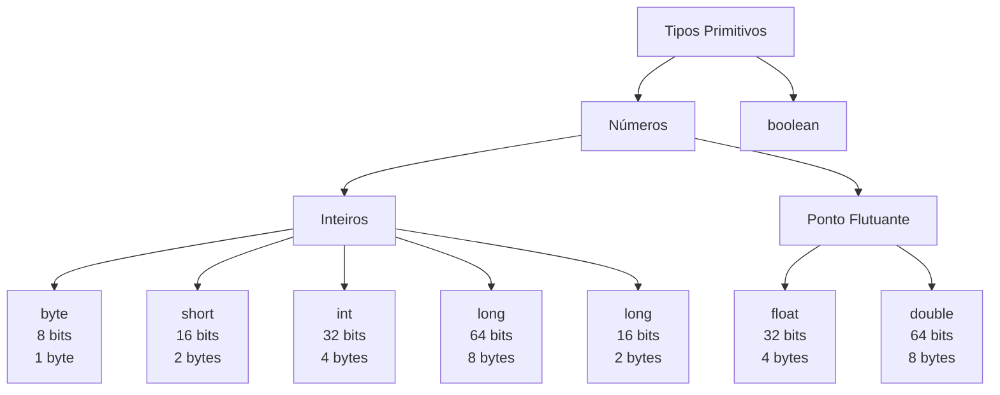

# Reaprendendo Java do Zero

### Observações

- Os nomes de classes seguem o padrão **PascalCase**.
- Os nomes de variáveis seguem o padrão **camelCase**.

### Como executar

Nosso código de exemplo:

```java
class HelloWorld {
    public static void main (String[] args) {
        System.out.println("Hello World!");
    }
}
```

Para executar um código Java diretamente execute:

```shell
java HelloWorld.java
```

Para compilar um programa Java execute:

```shell
javac HelloWorld.java
```

> Isso irá criar um arquivo `HelloWorld.class`, que é seu programa compilado.

Agora para executar rode:

```shell
java HelloWorld
```

> Note que quando já tem o programa compilado você não passa a extensão `.class` ao executar.

Para fazer disassembler do bytecode execute:

```shell
javap -c HelloWorld
```

Isso irá retornar:

```
Compiled from "HelloWorld.java"
class HelloWorld {
  HelloWorld();
    Code:
         0: aload_0
         1: invokespecial #1                  // Method java/lang/Object."<init>":()V
         4: return

  public static void main(java.lang.String[]);
    Code:
         0: getstatic     #7                  // Field java/lang/System.out:Ljava/io/PrintStream;
         3: ldc           #13                 // String Hello World!
         5: invokevirtual #15                 // Method java/io/PrintStream.println:(Ljava/lang/String;)V
         8: return
}
```

### Como funciona o compilador Java?

Um compilador Java é um programa que leva arquivos de código-fonte Java (com a extensão `.java`) e os traduz em arquivos Java bytecode (com e extensão `.class`). Bytecode é uma representação intermediária do código-fonte Java que é independente da plataforma. Isso significa que, uma vez que o código-fonte é compilado em bytecode, ele pode ser executado em qualquer sistema com uma JVM compatível.

O compilador Java faz parte do Java Development Kit (JDK). Quando você instala o JDK, você tem acesso ao javaccomando, que é o compilador Java padrão.

### Tipos de dados primitivos em Java


